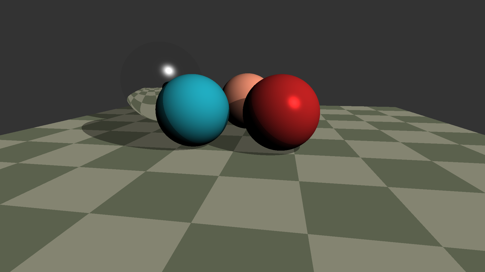

# Controls
    Mouse - rotate camera
    Wheel - zoom
    Q - switch shadows
    W - switch real point light
    E - switch mirrors
    R - switch colors
    D - increase light power
    F - decrease light power

# Result

